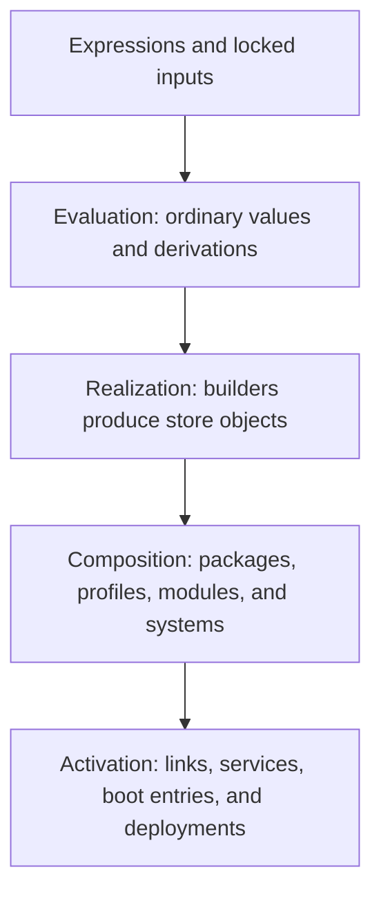

# The Nix Concept Map

## Learning objectives

By the end of this orientation you should be able to place each major Nix
term in one of four layers and explain why the same `.nix` syntax appears in
package, user, and operating-system configuration.

## “Nix” names several things

People use **Nix** to mean:

1. **The Nix language** — a lazy, dynamically typed expression language.
2. **The Nix package manager** — evaluator, build engine, store, profiles,
   command-line interface, daemon, and protocols.
3. **Nixpkgs** — a large Git repository containing package expressions,
   libraries, build helpers, and NixOS modules.
4. **NixOS** — a Linux distribution whose system is assembled from Nixpkgs
   modules and packages.
5. **The ecosystem** — flakes, Home Manager, nix-darwin, Hydra, deployment
   tools, cache services, and community libraries.

Confusing these layers causes most early misunderstandings. Flakes do not
replace the Nix language. NixOS is not required to use Nix. Home Manager is
not a package manager, although it asks Nix to build and activate packages
and files.

## The four-layer model



### 1. Source and inputs

Nix reads expressions plus explicit inputs: local files, Nixpkgs, source
archives, or other flakes. A flake lock file records an input graph. It does
not freeze undeclared network access inside a build, guarantee source
availability forever, or prove that a build is reproducible.

### 2. Evaluation

The evaluator reduces expressions to values. Most values are ordinary data:
strings, lists, functions, or attribute sets. A **derivation** is a special
value describing a build: builder, arguments, environment, declared inputs,
platform, and outputs.

Evaluation can discover a desired graph without running its builders.

```console
nix eval --expr 'let double = x: x * 2; in double 21'
nix derivation show nixpkgs#hello
```

### 3. Realization

Realization executes builders, or downloads trusted substitutes, until a
requested store path exists. Outputs live under `/nix/store` and are treated
as immutable. A path embeds an encoded digest derived from identifying build
information; it is not generally just a hash of the output bytes.

```console
nix build nixpkgs#hello
nix path-info --closure-size nixpkgs#hello
```

### 4. Composition and activation

Nixpkgs composes derivations into a package set. The module system composes
option declarations and definitions into configuration. NixOS builds an
entire system closure. Home Manager builds a user generation. nix-darwin
builds and activates a macOS configuration.

Activation is effectful and distinct from building. `nixos-rebuild build`
builds a system; `nixos-rebuild switch` also activates it.

## Three graphs, not one

Keep these related graphs separate:

- The **flake input graph** records where source inputs came from.
- The **derivation graph** records build-time dependencies.
- The **store reference graph** records references found in realized objects.

Garbage collection follows roots through the store reference graph. Updating
a flake changes the input graph. Cross compilation depends on relationships
in the package and derivation graphs.

## Declarative does not mean stateless

A declaration describes a desired build or configuration. Activation can
still mutate `/etc`, user profiles, service state, databases, and bootloader
entries. Nix generally manages artifacts and selected configuration; it does
not automatically manage all application data.

Likewise:

- **Repeatable input selection** is not identical to reproducible output.
- **Sandboxing** limits undeclared access but is not a complete security
  boundary.
- **Atomic profile switching** does not make every service or migration
  transactional.
- **Rollback** restores a previous generation, not arbitrary mutable data.

## Where tools fit

| Tool | Primary role |
| --- | --- |
| `nix` | Evaluate, build, run, develop, inspect, copy, and manage store data |
| Nixpkgs | Package collection, library, build conventions, and modules |
| Flakes | Input locking, output conventions, and project references |
| NixOS modules | Merge typed system configuration into a system build |
| Home Manager | Build and activate declarative user environments |
| nix-darwin | Apply the module pattern to macOS configuration |
| Hydra/CI | Evaluate job graphs and build them continuously |
| Binary cache | Serve signed metadata and NAR-serialized store objects |

## Common misconceptions

- **“Nix is just a dotfile format.”** It is an evaluator and build/store
  system; configuration projects are applications of it.
- **“A flake is a package.”** A flake is a source tree with locked inputs and
  an output function. One output may be a package.
- **“The hash proves reproducibility.”** It identifies an input-addressed
  build unless the output is content-addressed; nondeterministic builders can
  still produce different bytes.
- **“Installing a package copies it into my home.”** Nix realizes a store path
  and makes it reachable through a profile or environment.
- **“NixOS modules run in file order.”** Module definitions are merged through
  a fixpoint with option types, priorities, and ordering rules.

## Recap

Nix expressions evaluate to data and build descriptions. Builds or
substitutes realize immutable store objects. Profiles and module systems
compose those objects into environments and machines. Activation connects
the immutable result to a running, partly mutable world.

## Exercises

1. Classify `flake.lock`, a `.drv` file, `/nix/store/...-hello`, and
   `/run/current-system` by layer and graph.
2. Explain why `nix build` may perform no local compilation.
3. Explain why deleting `result` does not necessarily delete its target.
4. Give one example each of immutable Nix-managed state and mutable runtime
   state.
5. Draw the dependency path from a flake input to a running systemd service.

## Official references

- [How Nix works](https://nix.dev/manual/nix/latest/package-management)
- [Nix language](https://nix.dev/manual/nix/latest/language/)
- [Nix store](https://nix.dev/manual/nix/latest/store/)
- [Flake reference](https://nix.dev/manual/nix/latest/command-ref/new-cli/nix3-flake)
- [NixOS manual](https://nixos.org/manual/nixos/stable/)
- [Nixpkgs manual](https://nixos.org/manual/nixpkgs/stable/)
